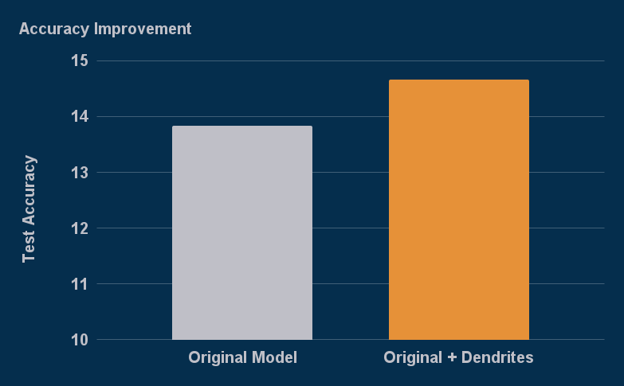
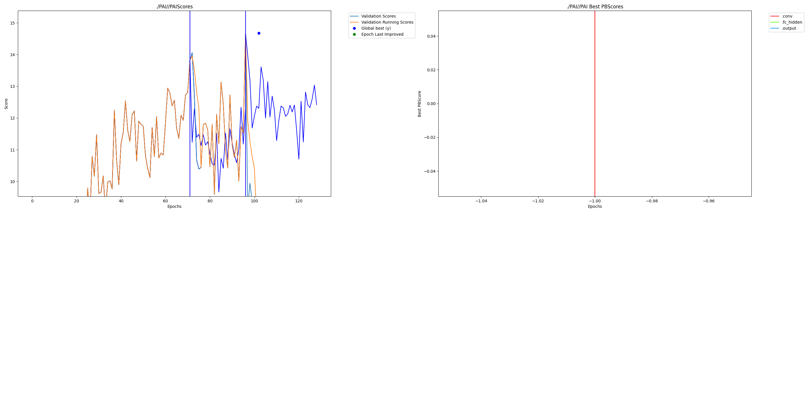

# MinAtar-Dendritic

[MinAtar](https://github.com/kenjyoung/MinAtar) is a testbed for AI agents which implements miniaturized versions of several Atari 2600 games.  

We have updated the DQN example here to leverage Dendrites.  Without Dendrites the maximum return for DQN playing breakout was 13.83.  With Dendritic Optimization the score increased to 14.67. 

## Installation

Install the required repo with the installation steps linked above

## Running

Run original with:

    python examples/dqn.py -g breakout

Run dendritic model with:

    python dqn_perforatedai.py -v -g breakout

## Outcomes:

Validation scores of original and dendrite optimized networks:

Graph generated by our run seen below:

