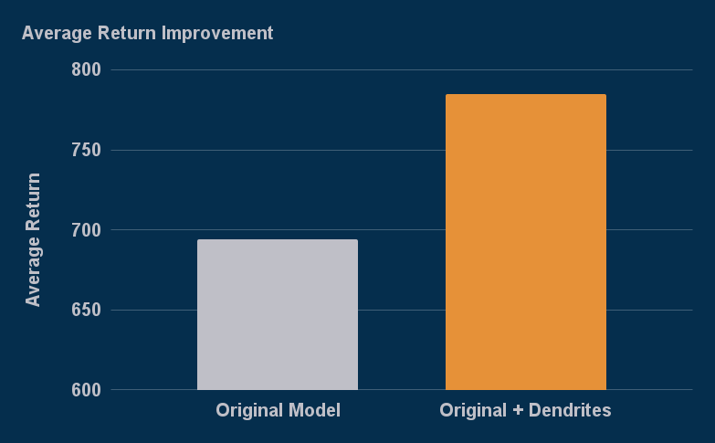
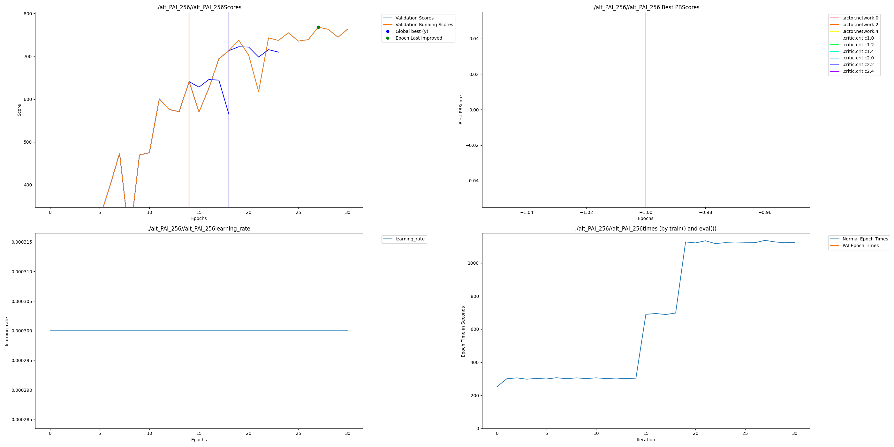

# Twin Delayed Deep Deterministic Policy Gradient (TD3) on DMControl

[DeepMind Control Suite](https://github.com/google-deepmind/dm_control) is a popular library for testing the performance of Reinforcement Learning
algorithms and models on continuous control tasks using MuJoCo as the underlying physics simulator. We selected Cheetah-Run as the control task for this example, as it is sufficiently challenging to demonstrate the benefits of dendrites while remaining computationally efficient.

TD3 is a model-free Reinforcement Learning algorithm that uses Deep Neural Networks (DNNs) for both the policy (actor) and value function approximators (critics). TD3 prevents Q-value overestimation by maintaining two critic networks and using the minimum Q-value between them during training. TD3 also uses delayed policy updates, updating the actor less frequently than the critics (typically every 2 critic updates). 

Without Dendrites the mean return for the best model was 693.84. With Dendritic Optimization the mean return for the best model increased to 784.91. This is a relative improvement of 13.13%.

## Installation

First, install perforatedai from the main folder with:

    pip install -e .

Then navigate to this directory (td3_reinforcement_learning) and run the following:
    pip install -r requirements.txt

Now you can run the scripts!

## Running

Run original with:

    python td3.py

Run dendritic model with:

    python td3_perforatedai.py

Both files have argument parsers that can be queried with the -h flag to see various options. The displayed outcomes use the default settings.

## Outcomes

Validation scores of original and dendrite-optimized networks:

Exact graph that gets generated within the output folder:

## Additional Resources

Within the additional_resources folder, the following are provided:

 1. A deep dive into the results and the reason why Dendritic Optimization would be useful for Deep Reinforcement Learning.
 2. A short explanation on how to use multiple optimizers with Perforated AI.
